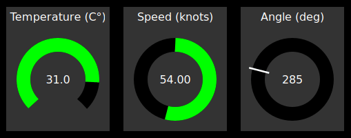

# Gauges

A dashboard for real-time data visualization.



## Install

If you have a rust toolchain, just clone this project and from the root
directory:

```shell
cargo install --path .
```

## Usage

Create a `gauges.toml` file (see example) and launch `gauges-server`

## Send data

In the `examples` directory you can find some examples of Rust clients:

- `canbus`: read signals from CAN bus and send them to `gauges-server`
- `client`: generate fake data and send them to `gauges-server`

You can easily send telemetry data to `gauges-server`, even without a Rust
client.

You just need to open a TCP socket and send some json message with newline
delimiter.

Example, from bash:

```shell
while sleep 1; do
  echo "{\"record\":{\"value\":{\"Float\":$( date +%S )}},\"id\":{\"Num\":1}}";
done | nc localhost 9999
```